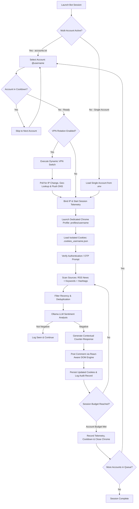

# Indian Army PR Command Center 🇮🇳

An automated, intelligent Instagram sentiment monitoring and public relations operations platform. The system monitors Instagram hashtags, search keywords, and live military news for negative or adversarial narratives concerning the Indian Armed Forces. It evaluates post content and sentiment using a local Ollama LLM, drafts factual, dignified, and patriotic counter-responses in the language of the source post, and publishes responses with automated multi-account and VPN rotation capabilities.

---

## Key Capabilities

- **Command Center Dashboard (`app.py`)**:
  - Unified **Bot Operations** interface integrating configuration, launch controls, live telemetry, and recent comment tracking in a single view.
  - **Real-Time Public Network Egress Badge**: Live indicator displaying active IP, Country, City, and ISP egress routing.
  - **Interactive Account Registry & Health Table**: Inspect account handles, cookie status, isolated profile states, safety cooldown countdowns, last IP bindings, and lifetime comments posted.
  - **Live Auto-Streaming Activity Feed**: Automatically streams execution logs in real-time every 2 seconds without full-page reloads.
  - **One-Click Engine Controls**: Launch, save configuration, pause, or terminate sessions directly from the web interface.
  - **Ollama Engine Management**: Built-in health check and automatic service starter for local LLM inference.

- **Multi-Account Rotation & Safety Architecture**:
  - Rotate across multiple Instagram accounts defined in `accounts.txt`.
  - **Dedicated Per-Account Browser Profiles (`profiles/<username>`)**: Isolated Chrome user-data directories preserve `localStorage`, `IndexedDB`, session tokens, and browser canvas fingerprints, preventing device-switching anomalies.
  - **Isolated Cookie Vaults**: Each account maintains its own isolated cookie store (`.cookies_<username>.json`), preventing session collisions or cross-account logout.
  - **Persistent Health & Cooldown Registry (`account_tracker.py`)**: Enforces configurable resting cooldowns (`account_cooldown_minutes: 15`) and logs IP bindings, session counts, and challenge states to `account_registry.json`.
  - **Per-Account Comment Budget**: Configurable comments per account (`comments_per_account`) to naturally distribute interaction volume.

- **Dynamic VPN & IP Rotation Engine (`vpn_manager.py`)**:
  - **Zero Blind Waits**: Dynamic polling (`poll_interval=1.8s`) verifies IP change the instant the VPN connection handshakes, eliminating rigid delays.
  - **Rich Geolocation Resolution**: Resolves IP, City, Country, and ISP via `http://ip-api.com/json/` with multiple fault-tolerant fallbacks.
  - **DNS Cache Flush**: Automatically clears Windows DNS cache (`ipconfig /flushdns`) post-rotation to eliminate stale socket connections.
  - Native integration with free Windows CLI VPN tools:
    - **Windscribe CLI**: `windscribe connect best`
    - **Proton VPN CLI**: `protonvpn-cli c -f`
    - **Cloudflare WARP**: `warp-cli disconnect && warp-cli connect`
    - **Custom Script**: Hook into [`rotate_vpn.bat`](rotate_vpn.bat) with any custom VPN command or proxy client.

- **Ultra-Reliable 3-Step Login & Cookie Persistence**:
  1. **Session Cookie Restore**: Fast-boots existing sessions from `.cookies_<username>.json` or `cookies.json`.
  2. **Humanized Typing**: Types credentials with randomized human keystroke intervals (0.05s–0.18s).
  3. **Verification & OTP Handler**: Pauses and allows interactive entry for two-factor (2FA), SMS/email codes, and security challenges.
  4. **Guaranteed Cookie Persistence**: Automatically serializes and saves fresh session cookies on **every** successful login path (automated typing, OTP verification, or manual browser login).

- **Strict LLM Sentiment Detection**:
  - Evaluates captions against Indian Army guidelines. Adversarial narratives and anti-army hashtags (`#indianarmycrimes`, `#armyatrocities`, `#kashmirviolence`) trigger counter-engagement.
  - **Language-Adaptive**: Replies dynamically in the language and dialect of the source post (Hindi, English, Hinglish, Urdu).

- **Dynamic Source Targeting**:
  - **Live Defense News RSS**: Aggregates breaking defense news via Google News RSS and automatically converts trending topics into Instagram search queries.
  - **Keyword & Hashtag Scanners**: Explores top posts and recent hashtag feeds.
  - **Recency Filter**: Skips posts older than a configurable threshold (`max_age_days`) to focus engagement strictly on active discussions.

---

## Architecture & Workflow



---

## Prerequisites

1. **Python 3.10+**: Installed and available in your system `PATH`.
2. **Google Chrome**: Standard desktop Google Chrome installed.
3. **Ollama**: Installed and running locally.
   ```powershell
   # Pull default recommended model
   ollama pull llama3.2
   ```
4. **(Optional) Free VPN CLI**: If using automated VPN rotation:
   - [Windscribe](https://windscribe.com/) (`windscribe-cli`)
   - [Proton VPN](https://protonvpn.com/) (`protonvpn-cli`)
   - [Cloudflare WARP](https://1.1.1.1/) (`warp-cli`)

---

## Installation & Setup

### 1. Clone & Set Up Environment

```powershell
# Clone the repository
git clone https://github.com/inddivyansh/prmodules.git
cd prmodules

# Create virtual environment
python -m venv .venv

# Activate virtual environment
.\.venv\Scripts\Activate.ps1

# Install required dependencies
pip install -r requirements.txt
```

### 2. Configure Credentials

#### Option A: Single Account Setup (`.env`)
Copy `.env.example` to `.env` and fill in your account details:
```powershell
Copy-Item .env.example .env
```
Edit `.env`:
```env
INSTAGRAM_USERNAME=your_instagram_handle
INSTAGRAM_PASSWORD=your_instagram_password
```

#### Option B: Multi-Account Rotation Setup (`accounts.txt`)
Copy `accounts.txt.example` to `accounts.txt`:
```powershell
Copy-Item accounts.txt.example accounts.txt
```
Edit `accounts.txt` with your rotation IDs (one per line):
```text
army_supporter_01:PasswordOne123!
army_supporter_02:PasswordTwo456!
army_supporter_03:PasswordThree789!
```

---

## Running the Application

### Method 1: Web Command Center (Recommended)

Launch the Streamlit Command Center dashboard:

```powershell
streamlit run app.py
```
*Or using the virtual environment directly:*
```powershell
.\.venv\Scripts\streamlit.exe run app.py
```

Open your browser to `http://localhost:8501`:
1. Review or modify operational parameters in the **Bot Operations** tab.
2. If using multiple accounts or VPN rotation, expand **Multi-Account Rotation & Automated VPN Switching**.
3. Click **Launch Bot Session**.
4. Watch live actions, sentiment verdicts, and comments stream in the **Live Activity Feed**.

---

### Method 2: Headless / Terminal Execution

To run the engine directly from the command line:

```powershell
python bot.py
```
*Or using the virtual environment:*
```powershell
.\.venv\Scripts\python.exe bot.py
```

---

## Automated VPN & IP Rotation Guide

When operating multiple Instagram accounts, rotating IP addresses ensures accounts are not linked by IP address or rate-limited.

### Testing VPN Rotation via CLI
Test your current IP and rotation hook at any time:
```powershell
# Check current public IP and detected VPN tools
python vpn_manager.py status

# Test rotation execution
python vpn_manager.py rotate
```

### Configuring Rotation Commands
You can configure the rotation command via the Dashboard or `bot_config.json`:
- **Windscribe**: `"C:\Program Files\Windscribe\windscribe-cli.exe" connect best`
- **Proton VPN**: `protonvpn-cli c -f`
- **Cloudflare WARP**: `warp-cli disconnect && warp-cli connect`
- **Custom Script**: Edit [`rotate_vpn.bat`](rotate_vpn.bat) and use `rotate_vpn.bat`.

---

## Operational Configuration Reference (`bot_config.json`)

| Parameter | Default | Description |
| :--- | :--- | :--- |
| `model` | `llama3.2` | Ollama model utilized for sentiment classification and response generation. |
| `strategy` | `trending_first` | `trending_first`: Live news queries first, then keywords and hashtags.<br>`negative_first`: Negative tags first, then keywords.<br>`balanced`: Shuffles all feeds evenly.<br>`positive_only`: Scans official feeds for troll brigading. |
| `max_comments` | `12` | Total session comment ceiling across all accounts. |
| `comments_per_account` | `3` | Maximum comments posted before rotating to the next account. |
| `account_cooldown_minutes` | `15` | Minimum resting time (minutes) before an account can be re-selected in rotation to prevent anti-bot spam flags. |
| `delay_seconds` | `120` | Base wait time between successive comments (randomized ±25%). |
| `max_age_days` | `14` | Recency cutoff: skips posts published older than $N$ days. |
| `headless` | `false` | `false`: Visible Chrome browser (required on first run / verification).<br>`true`: Background browser. |
| `enable_trending` | `true` | Fetches live defense headlines via Google News RSS. |
| `enable_vpn_rotation` | `false` | Automatically triggers VPN rotation command before switching accounts. |
| `vpn_rotate_command` | `""` | CLI command executed to rotate VPN IP. |
| `vpn_cooldown_seconds`| `8` | Network settle timeout: maximum seconds to poll for dynamic IP change. |

---

## Audit Logs & Output Files

| File | Purpose |
| :--- | :--- |
| `negative_posts.csv` | Log of all flagged posts: ID, handle, permalink, caption snippet, sentiment, and response status. |
| `response_log.csv` | Complete response audit trail: post link, generated counter-narrative text, timestamp, and status. |
| `seen_posts.json` | Persistent deduplication index tracking processed posts across all runs. |
| `account_registry.json` | Persistent multi-account telemetry registry: tracks session count, lifetime comments posted, last active timestamp, and IP/ISP bindings. |
| `profiles/<username>/` | Dedicated browser user-data directories isolating local storage, IndexedDB, and canvas fingerprint per account. |
| `monitor.log` | Consolidated, timestamped runtime execution log. |
| `.cookies_<username>.json` | Per-account serialized session cookies for automatic session restoration. |
| `rotate_vpn.bat` | Customizable Windows batch script for VPN command triggers. |

---

## Project Structure

```
PR/
├── app.py                  # Streamlit Command Center UI & Live Telemetry Feed
├── bot.py                  # Core autonomous engine (scrapes, classifies, comments, rotates)
├── shared.py               # Shared automation framework (Selenium driver, multi-cookies, CSV I/O)
├── vpn_manager.py          # Dynamic IP verification & automated VPN rotation manager
├── account_tracker.py      # Multi-account telemetry, cooldowns, and health registry
├── rotate_vpn.bat          # User-customizable VPN rotation batch script
├── accounts.txt.example    # Multi-account credentials template
├── bot_config.json.example # Operational settings template
├── .env.example            # Environment variables template
├── requirements.txt        # Python package dependencies
├── seen_posts.json         # Deduplication history (auto-generated)
├── account_registry.json   # Multi-account health and telemetry state (auto-generated)
├── profiles/               # Isolated Chrome user profiles per account (auto-generated)
├── negative_posts.csv      # Flagged negative posts log (auto-generated)
├── response_log.csv        # Counter-comment audit history (auto-generated)
└── monitor.log             # Consolidated execution log (auto-generated)
```

---

## Safety & Best Practices

1. **First-Time Login**: Keep `headless: false` during initial login or when adding new accounts so you can solve any Instagram security prompts or CAPTCHAs.
2. **Session Cookies**: Never delete `.cookies_<username>.json` files; reusing valid session cookies minimizes login challenges.
3. **Paced Activity**: Maintain conservative comment quotas (`comments_per_account: 2-3`, `delay_seconds: 90-180`) to ensure natural interaction pacing.
4. **Credential Security**: Never commit `.env`, `accounts.txt`, or cookie files to public repositories (`.gitignore` is pre-configured to exclude them).
